<div align="center">
  <h1>AI Glasses Manager</h1>
  <p><strong>A glasses-first home for apps, media, files, device tools, and everyday controls on Rokid Glasses.</strong></p>
  <p>
    <a href="https://github.com/Phantom-Not/ai-glasses-manager-releases/releases/latest">Download the latest release</a>
    &nbsp;&nbsp;•&nbsp;&nbsp;
    <a href="https://github.com/Phantom-Not/ai-glasses-manager-releases/issues">Report an issue</a>
  </p>
</div>

AI Glasses Manager brings tools that are usually scattered across Android into one interface designed for Rokid Glasses. It is built for quick navigation on a compact display, with readable focus states, restrained AR-friendly visuals, and direct access to useful controls.

The project began as **Rokid Manager**. As it grew beyond basic settings and device shortcuts, it became **AI Glasses Manager**. The goal is to explore what a genuinely useful, dependable software ecosystem for Rokid Glasses can look like.

<p align="center">
  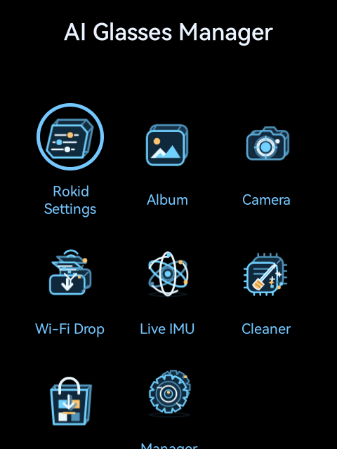
  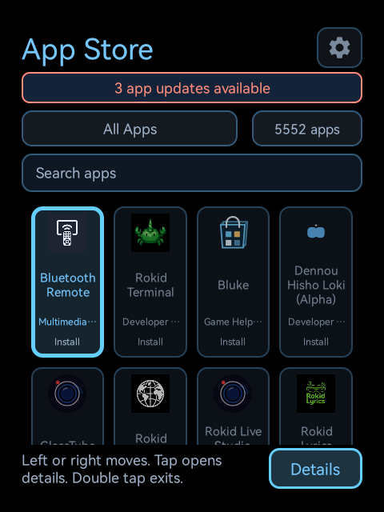
  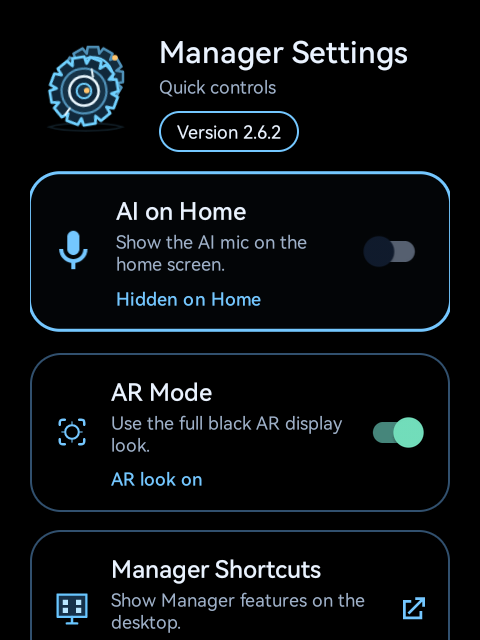
</p>
<p align="center"><sub>Home&nbsp;&nbsp;•&nbsp;&nbsp;App Store&nbsp;&nbsp;•&nbsp;&nbsp;Manager Settings</sub></p>

## Why it exists

I wanted a simple and intuitive way to tap into the glasses' features for daily use. Glasses like these need a good ecosystem more than a launcher, and people need a reliable way to discover software, manage updates, move files, work with photos and video, understand the hardware, and reach system controls without always relying on the phone APP.

AI Glasses Manager is a practical attempt to build that missing layer. Features are shaped by real use on the glasses, with an emphasis on predictable navigation, useful offline behavior, and tools that feel at home on a wearable display.

## Features

### App Store and app management

- Browse thousands of Android apps from a glasses-friendly catalog.
- Explore curated, developer, global, and China-friendly selections.
- Search by name and move through categories without leaving the main interface.
- Review app details before downloading or installing.
- See available updates for supported installed apps.
- Keep browsing previously loaded information when the network is unavailable.
- Receive clear offline guidance instead of waiting on a connection that is not there.

### Camera and Gallery

- Take photos or record video from a purpose-built Camera interface.
- Adjust capture mode, framing, zoom, and grid controls without leaving the viewfinder.
- Choose whether Camera shutter and recording sounds are used.
- Get immediate visual confirmation when a capture succeeds or fails.
- Browse photos and videos in Album, with media viewing and video playback designed for the glasses display.
- Delete photos and videos directly from Album when cleaning up local storage.

<p align="center">
  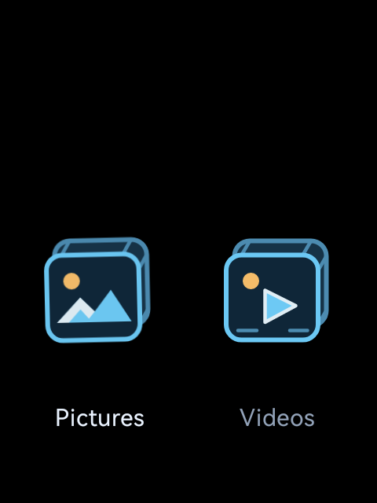
  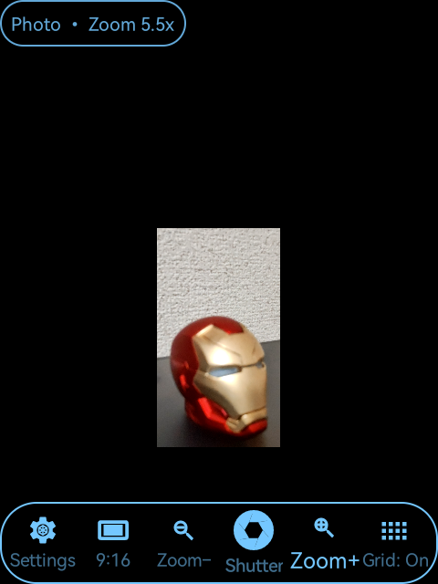
  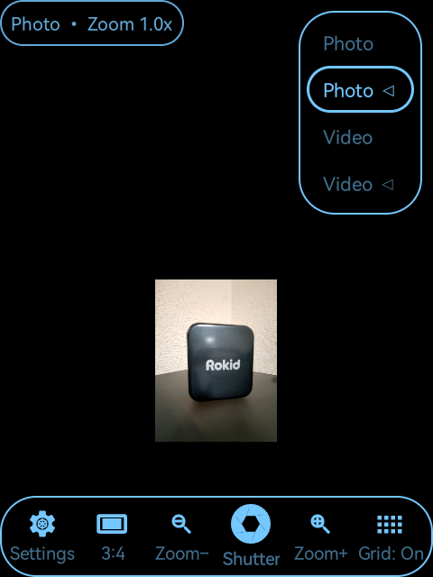
</p>
<p align="center"><sub>Gallery&nbsp;&nbsp;•&nbsp;&nbsp;Zoom controls in the viewfinder&nbsp;&nbsp;•&nbsp;&nbsp;Photo and video mode selector</sub></p>

### Files and wireless transfer

- Browse local storage and open common files directly on the glasses.
- Move through folders without relying on a separate phone interface.
- Use Wi-Fi Drop to transfer files between the glasses and supported phones or computers without connecting through ADB each time.
- Reach storage information and Android's related system tools from the same Manager.

### Device controls and diagnostics

- Open Rokid and Android settings from a consistent glasses-first menu.
- Reach Wi-Fi, Bluetooth, sound, keyboard, installed apps, storage, and battery tools.
- Adjust system volume and glasses volume separately, or lock the glasses volume at a fixed level.
- Configure swipe feedback from the Manager.
- Use Cleaner for one-tap maintenance or to review running apps.
- View live compass, accelerometer, gyroscope, pitch, and roll information in Live IMU.
- Calibrate or zero sensor readings when working with motion and orientation.

<p align="center">
  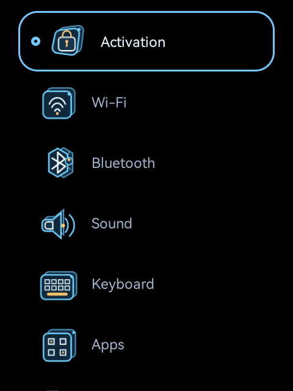
  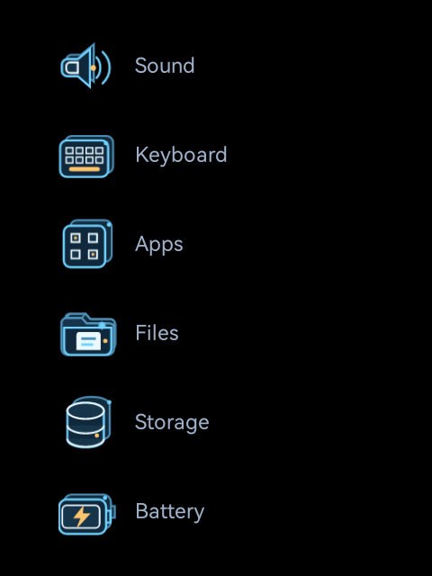
  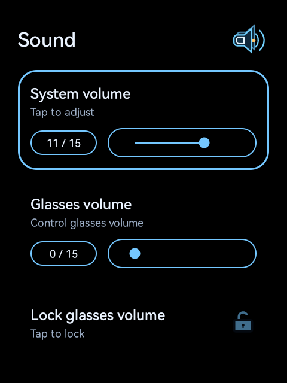
</p>
<p align="center"><sub>Connectivity and input&nbsp;&nbsp;•&nbsp;&nbsp;System tools&nbsp;&nbsp;•&nbsp;&nbsp;Sound controls</sub></p>

### AI and hands-free access

- Enable an optional AI microphone control from Manager Settings.
- Use supported voice actions when hands-free operation is more practical than the touchpad.
- Check the built-in AI command guide for supported English and Chinese examples.
- Keep AI access hidden from Home when it is not needed.

### Manager Shortcuts

Camera, Album, App Store, and File Explorer can be added as optional Manager Shortcuts in the Rokid launcher. Each shortcut opens the matching Manager feature directly, while the Manager remains the single place to enable or remove them.

<p align="center">
  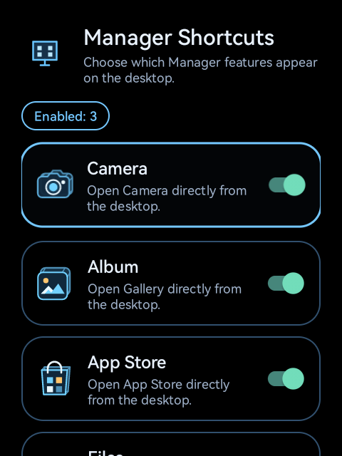
  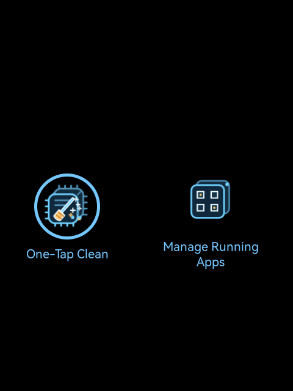
  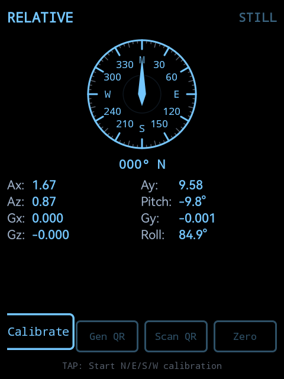
</p>
<p align="center"><sub>Manager Shortcuts&nbsp;&nbsp;•&nbsp;&nbsp;Cleaner&nbsp;&nbsp;•&nbsp;&nbsp;Live IMU</sub></p>

## Designed for the glasses

- Clear focus states keep the selected action visible without depending on color alone.
- AR Mode for obstructive and better viewing on the glasses display.
- Local tools remain useful when Wi-Fi is unavailable.
- Consistent interaction patterns carry across apps, settings, and utilities.
- The interface supports English, Simplified Chinese, Traditional Chinese, Cantonese (Hong Kong), Japanese, Korean, Russian, French, German, and Spanish. 

## Install

1. Open the [latest release](https://github.com/Phantom-Not/ai-glasses-manager-releases/releases/latest).
2. Download the AI Glasses Manager APK.
3. Install it with the Android package installer, or from a connected computer with:

   ```bash
   adb install -r AI-Glasses-Manager-<version>.apk
   ```

Once installed, open **AI Glasses Manager** from the Rokid launcher. Future Manager releases can also be checked from **Manager Settings → App Update**.

For safety, download Manager builds only from this repository or from an official mirror listed in [`manager-update.json`](manager-update.json).

## Compatibility

AI Glasses Manager is designed and tested for Rokid Glasses. Available system actions can vary with glasses firmware and Android version because some controls are provided by the underlying system.

The Manager requires Android 8.0 (API 26) or later. Features that use the camera, microphone, storage, nearby devices, or network request the corresponding Android permission when needed.

## More to come

AI Glasses Manager is actively developed, and more features will be added as they are ready for daily use on the glasses. New work will continue to focus on useful controls, stronger standalone use, and a broader software ecosystem for Rokid Glasses.

## Feedback and issue reports

Real-hardware feedback is what moves the project forward. If something does not behave correctly on your glasses, [open an issue](https://github.com/Phantom-Not/ai-glasses-manager-releases/issues) with:

- your Manager version;
- glasses model and firmware version;
- the feature you were using;
- the steps that reproduce the problem;
- a screenshot, if it does not contain personal information.

Please remove device identifiers, network names, activation details, and personal files before posting.

## About this repository

This repository hosts official AI Glasses Manager release metadata, APK downloads, screenshots, and public documentation. It is not the application source repository.

AI Glasses Manager is an independent project and is not affiliated with or endorsed by Rokid.
